##Instructions

##Design
For the original wireframe, visit the [UXPin](http://app.uxpin.com/2dbad5b0f5e911d61e5d8e67ece4a404c4a43376/4634561).

###Overall Design
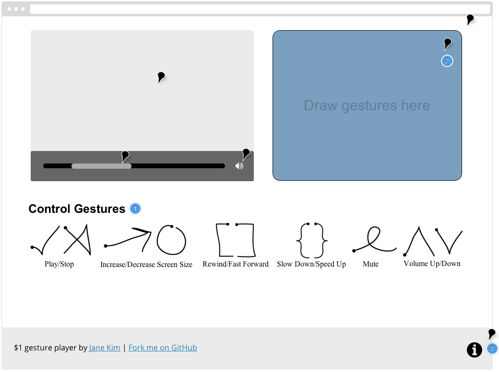

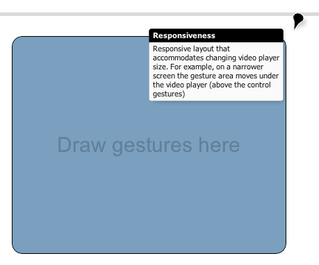

###Gesture Area
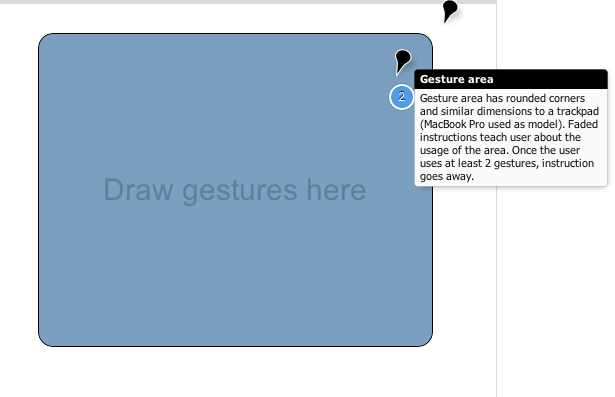

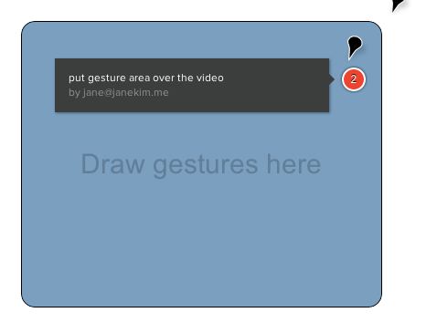

###Player
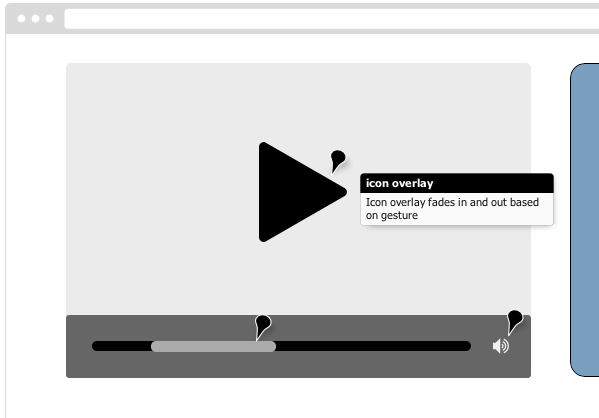

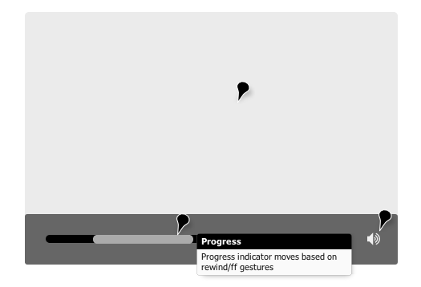

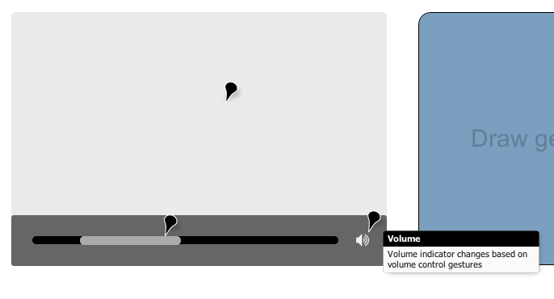

###Help/Documentation
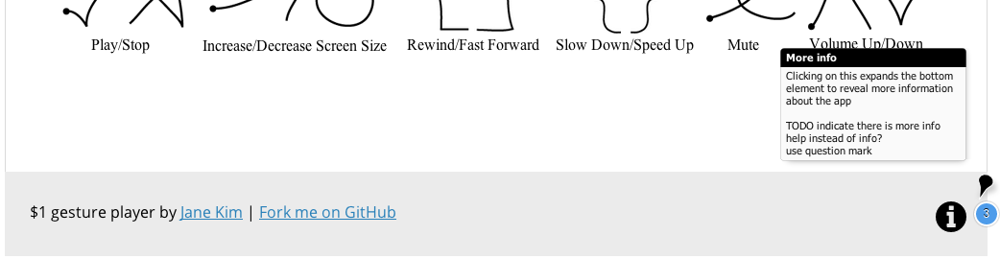

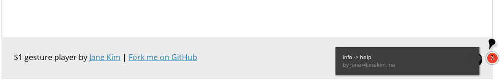

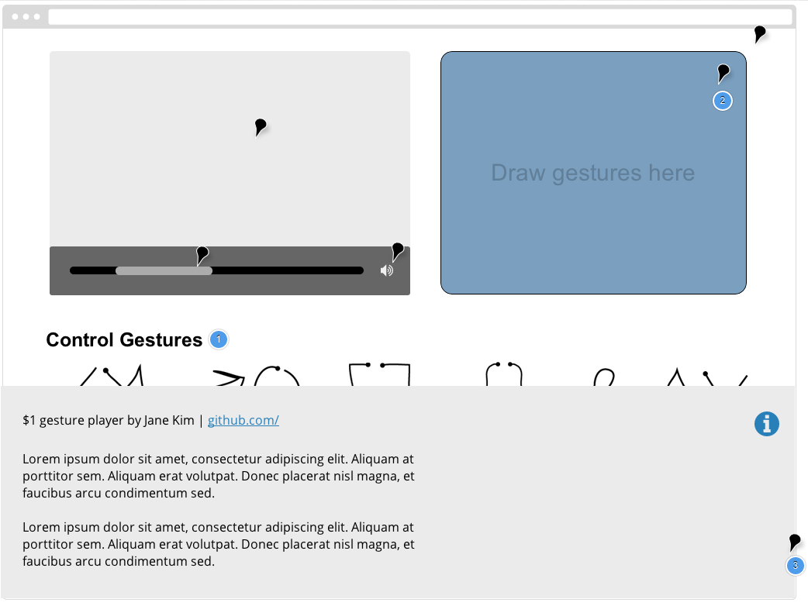

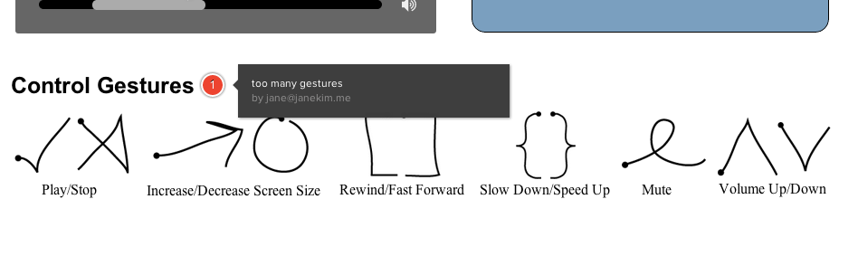

##Development

##Justification

HTML5 `<video>` application that uses gestures to interact with player

##Attribution
* video from [HTML5 Rocks](http://www.html5rocks.com/en/tutorials/video/basics/)
* Resources used: [HTML5 Rocks](http://www.html5rocks.com/en/tutorials/video/basics/),

##resources
* [$1 Unistroke Recognizer](http://depts.washington.edu/aimgroup/proj/dollar/)
* [W3 Video Media Events](http://www.w3.org/2010/05/video/mediaevents.html)
* [Original assignment](http://graphics.cs.columbia.edu/courses/csw4170/assn3-13f.htm)
* [$P paper](http://faculty.washington.edu/wobbrock/pubs/icmi-12.pdf)

#Notes
####gestures to support:
* play
* pause
* seek (i.e. setting `currentTime` attribute)
* control `playbackRate`
* control volume (incl. mute)
* width & height attributes

####specs
* hardcode video, no state persistence
* test in chrome (~30.0)
* gestures in `<canvas>`, can be anywhere in the window
* use lo-fi prototyping techniques
* using heuristics and shit
* the precision with which you allow the user to determine the value of an attribute, and whether it is set to an absolute value or modified relative to its current value.
* You can compute your own information about a gesture while you are accumulating a stroke to send to the recognizer, or after you have accumulated the stroke, or even after you have performed gesture recognition.
* could base your decision about what action to perform on factors such as where a gesture begins or ends, or the direction in which its first or last few points are drawn, in addition to the template match returned by the recognizer.
* multistroke recognition - use points or timeout; a nice alternative to an explicit trigger to invoke recognition, such as a right mouse click

####documentation
* documentation of design
* explain app development using images of initial sketches/paper prototypes
* explain what/how application using screenshots
* justify UI design decisions (usability heuristics)

###submit `jk3316_assn3.zip`
* documentation [pdf]
* webpage [folder]
* README [.]
* submit to CW
