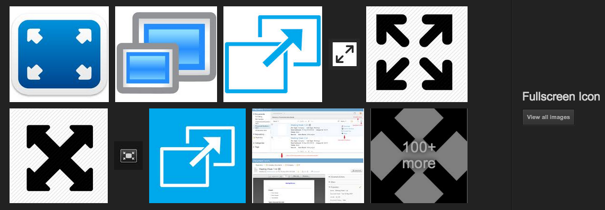

#$1 Gesture Video Player

##Usage
Open up `app/index.html` in Chrome.

In the blue box (gesture area), draw the gesture corresponding to the action you want to execute.  
"Rewind/Fast Forward" changes the current position in video by 15 seconds or 5% of the duration of the video.  
"Slow Down/Speed Up" supports speeds from 0.5x to 5x.  
Changing the volume unmutes the video.  
Minimum player width is 200px.  
Click the  icon to hide this information.  
**Note:** This website is best viewed in a large screen or fullscreen mode.

##Wireframe/Design
For the original wireframe, visit the [UXPin](http://app.uxpin.com/2dbad5b0f5e911d61e5d8e67ece4a404c4a43376/4634561) I created for this assignment (in case that does not wor, see `UXPin-Design/index.html`). See images below for snippets of the original design with some annotations.

###Initial Thoughts
I wanted to create a minimal interface that has a lot of similarities with other video players. In general, using gestures on a desktop or laptop is an awkward interaction and clumsy at best. If I had more free reign on this project, I would have implemented this for mobile. A lot of considerations were made based on the space available on a regular sized screen in Chrome, what kind of gestures would correlate to which actions to avoid confusion and improve usability, and resources available. 

###User Feedback
I showed the wireframe to a couple of users. Their general feedback was that the usage of gestures on a laptop was not ideal because of the awkwardness of dragging and drawing on a laptop mousepad. Ideally, this project would be implemented for mobile devices (having the gesture area be a touch area where the user could draw gestures with their fingers, making the actions more intuitive), but the specs of the assignment called for usage in a browser (specifically Chrome).  
I changed the info icon to be a question mark to make it more obvious that there was helpful information in the footer, and I expand the footer when the website is opened to show that the area is expandable and potentially useful.

###Overall Design

###Gesture Area

###Help/Documentation

##Development & Justification

###About
HTML5 `<video>` application that uses gestures to interact with player controls.

###Overall

The app has 4 main areas:

* video player
* gesture area
* gesture key/legend
* help/info footer

I decided to use most of the implementation from the demo on the $1 Dollar Gesture website. I found that the gestures worked relatively well and especially if the user is given a large enough gesture area. I took out gestures 

###App Start
  
When the app starts, the footer is expanded with help/documentation for the user and it closes after a short period of time.

###Footer
  
The footer contains links to the creator of the website and the sourcecode. Clicking on the question mark icon expands the footer and reveals information and usage of the website, along with the detailed funtionality of some of the gestures. This was done because the controls may be obvious but the way the controls are implemented are not as clear since there are no controls visible. I decided to hide away info because the user does not always need the instructions but does need to reference the gestures semi-frequently.

###Gesture Area

The gesture area is blue to contrast with the rest of the page and draws the user's attention to it. A simple instruction appears when the user hovers over the area. The shape for the area is a visual cue that signals the user that this area is meant to be interacted with like a laptop's touchpad. I made the area large enough so there would be room to draw gestures clearly enough; if the area was smaller some of the more complex gestures would not be able to be recognized.

###Video Player

The video player is an HTML5 `<video>`. I hid the default controls programmatically in order to control the video through the gestures. The video has a default width similar to that of default video sizes on other websites (~600px).

###Legend

The legend is where all the gestures are shown. Each gesture corresponds to a separate control, and similar controls are grouped together. 

I tried to order the gestures by how they would be seen on a normal video player, with play/pause functionality on the left, playback information in the middle, and volume on the right.  
I used 'triangle' for play because a play button usually is a triangle. I used the brackets and curly braces for actions that are usually visualized horizontally like playback speed and playback position (see example of YouTube controls above). I used brackets to control playback position because they are easier to draw than curly braces, and playback position is more often utilized than changing speed. I used the 'pigtail' for mute because the pigtail is usually used for deletion (so the action is most like "deleting" sound). 

'arrow' is used for enlarging screens because arrows pointing out usually signify enlarging or fullscreen mode.  
 
I used 'v' and 'caret' for volume because volume is usually visualized vertically.

When a gesture is used, it is outlined in the gesture area to notify the user which control was executed.

###Responsive

When the screen or video is resized, the elements on the page realign so the user only have to scroll down to see the rest of the page.

###Accessibility

The website is optimized for accessibility. Most of the elements on the page have a `title` attribute, a great HTML5 attribute that sets the tooltip for the element you are hovering over. All the images have `alt` tags as well. 

###Heuristic Evaluation

* ####Visibility of system status
	* outlines which gesture was drawn
	* the gesture appears as the user draws in the gesture area

* ####Match between system and the real world
	* gesture area resembles mousepad
	* size of video is like that of videos on YouTube
	* the order of gestures is modeled after the order of controls on YouTube videos
	* most gestures resemble in some way the actions they control
	* a popup/expanding div appears at the bottom containing information. 
	* question mark icon for help
 
* ####Consistency and standards
	* a popup/expanding div appears at the bottom containing information. 
	* question mark icon for help
	* explicit names for each of the controls
	* paired gestures picked for each action
		 
* ####Error prevention
	* invalid gestures are not processed
	* gestures picked for each action that are not too similar
	* only gestures inside blue area are processed
 
* ####Recognition rather than recall
	* legend with all the gestures displayed with the control/action name
	* help area is expanded when the website is first visited and remains available
	* to reduce memorization, gestures try to mimic the actions they correspond to
 
* ####Flexibility and efficiency of use
	* responsive design allows for flexibility of screen size
 
* ####Aesthetic and minimalist design
	* only gestures used are displayed
	* blue gesture area invites user to interact with it
	* overall contrast of the page (blue, white, black)
	* instructions are hid away (only seen when hovering over gesture area or help icon clicked)
 
* ####Help users recognize, diagnose, and recover from errors
	* prompted to try again when an invalid gesture is drawn or if something is drawn accidentally
 
* ####Help and documentation

	* footer with short, concise, and useful help and info exposed by icon click

##Resources
* video from [WebM Files](http://www.webmfiles.org/demo-files/)
* [$1 Unistroke Recognizer](http://depts.washington.edu/aimgroup/proj/dollar/)
* [W3 Video Media Events](http://www.w3.org/2010/05/video/mediaevents.html)
* [Original assignment](http://graphics.cs.columbia.edu/courses/csw4170/assn3-13f.htm)
* [HTML5 Rocks](http://www.html5rocks.com/en/tutorials/video/basics/),

#Notes

###submit `jk3316_assn3.zip`
* documentation [pdf]
* webpage [folder]
* README [.]
* submit to CW
